记录一次qemu虚拟机磁盘映像扩容办法，云主机在扩容磁盘后也可通过Parted及后续命令完成磁盘扩容。

## 确认qcow2

#### 列出所有node

`$ virsh list --all`
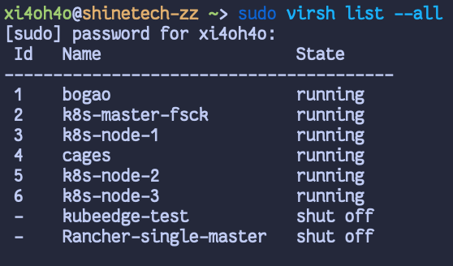

#### 查看qcow2磁盘位置

`virsh domblklist {node-id}`
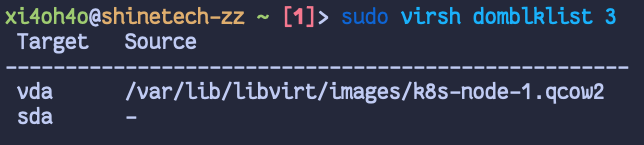

#### 查看qcow2信息

`qemu-img info -U {file-name.qcow2}`
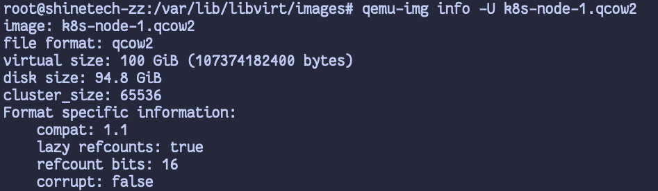

## 扩容qcow2

#### 关闭VM避免数据错误

`virsh destroy {node-name}`
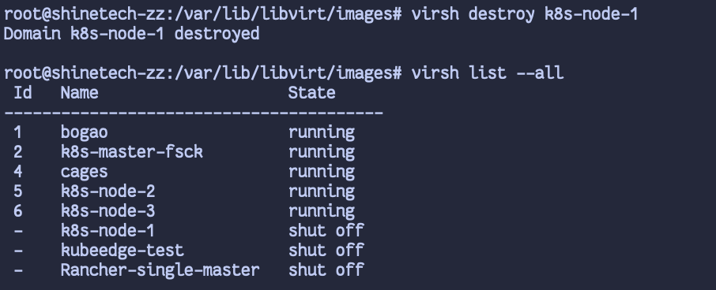

#### 扩容qcow2容量 + 100G

`qemu-img resize {filename.qcow2} +100G`
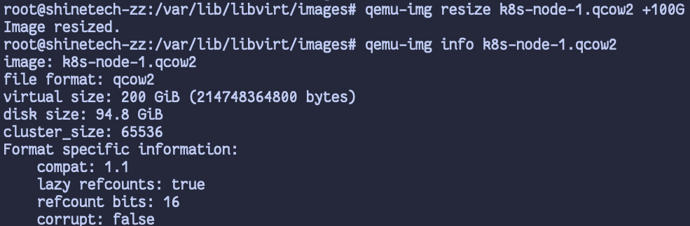

## 进入VM扩容分区

#### 开启VM

`virsh start {node-name}`
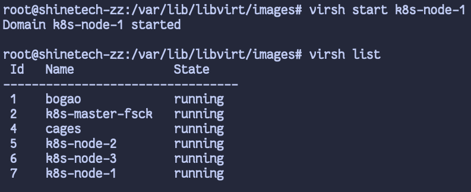

#### Parted 扩容分区

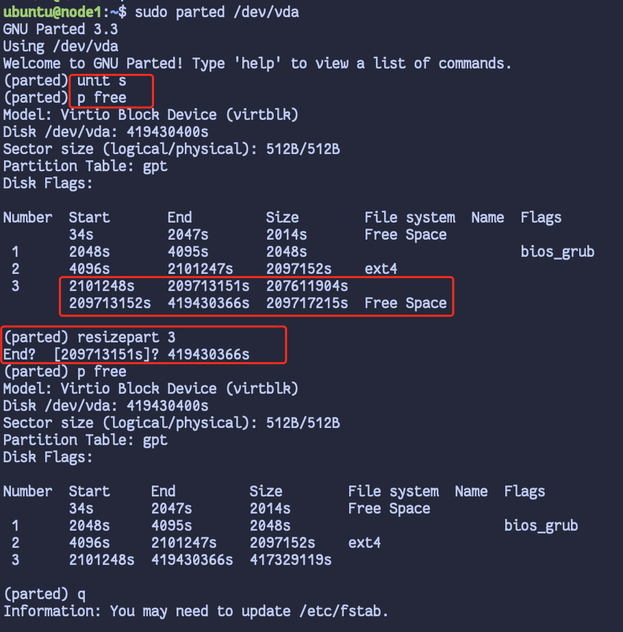

#### 调整物理卷

`pvresize /dev/vda3`

#### 查看物理卷

`lvdisplay`
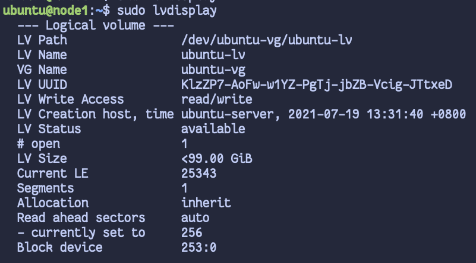

#### 扩容物理卷

`lvextend -l +100%FREE /dev/ubuntu-vg/ubuntu-lv`
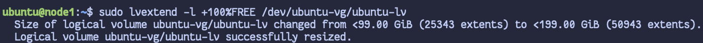

#### 重扫描分区

`sudo resize2fs /dev/ubuntu-vg/ubuntu-lv`
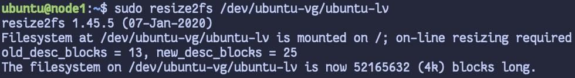

## 检查扩容成果

`df -h`
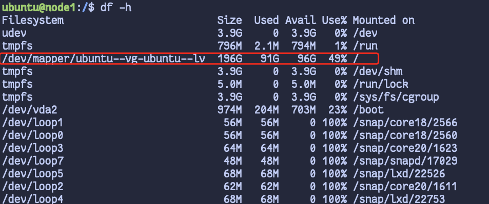
