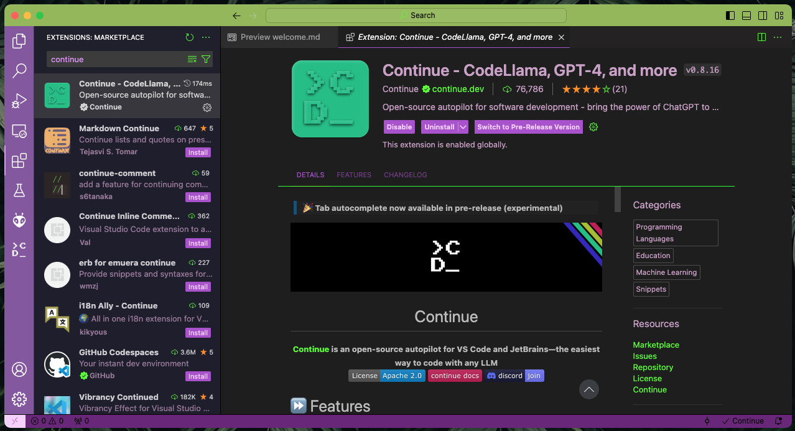
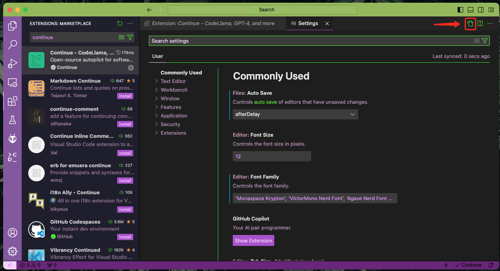

简单整理一下如何使用continue扩展配合ollama让VS Code支持本地运行的LLM实现AI代码补全

## Requirements

- Ollama.ai
- continue.dev

## 在本地准备LLM运行环境

### Install Ollama

#### On the Mac

下载 ollama app https://ollama.com/download 运行即可

#### On Linux / WSL

##### CPU Only

```bash
docker run -d -v ollama:/root/.ollama -p 11434:11434 --name ollama ollama/ollama
```

##### Nvidia GPU

安装 [Nvidia container toolkit](https://docs.nvidia.com/datacenter/cloud-native/container-toolkit/latest/install-guide.html#installation "Nvidia container toolkit")
Run Ollama inside a Docker container

```bash
docker run -d --gpus=all -v ollama:/root/.ollama -p 11434:11434 --name ollama ollama/ollama
```

### Install LLM Model

这里安装 [`starcoder:3b`](https://ollama.com/library/starcoder:3b "`starcoder:3b`")

#### Mac

```bash
ollama run starcoder:3b
```

#### Docker

```bash
docker exec -it ollama ollama run starcoder:3b
```

确保模型下载完成，并成功启动


## 在VSCode安装 continue 扩展

VSCode Extension https://marketplace.visualstudio.com/items?itemName=Continue.continue


### 配置Tab自动补全

在VS Code扩展安装后，进入"Settings" 点击箭头编辑settings.json


在JSON配置中增加 tab auto complete 配置

```jsonc
{
...
  "tabAutocompleteModel": {
    "title": "Tab Autocomplete Model",
    "provider": "ollama",
    "model": "starcoder:3b",
    "apiBase": "https://127.0.0.1:11434"
  },
  "tabAutocompleteOptions": {
    "useCopyBuffer": false, // Determines whether the copy buffer will be considered when constructing the prompt. (Boolean)
    "maxPromptTokens": 400, // The maximum number of prompt tokens to use. A smaller number will yield faster completions, but less context. (Number)
    "prefixPercentage": 0.5 // The percentage of the input that should be dedicated to the prefix. (Number)
  },
  "continue.enableTabAutocomplete": true
}
```


## 测试

使用VS Code新建一个Python，这里我们添加一个注释来获得城市天气并输出JSON

出现预览后可敲击Tab补全

除了`starcoder-3b`外，还可以选择 `starcoder-1b` 或者 `deepseek-1b` 这种更小的模型以提升速度。
